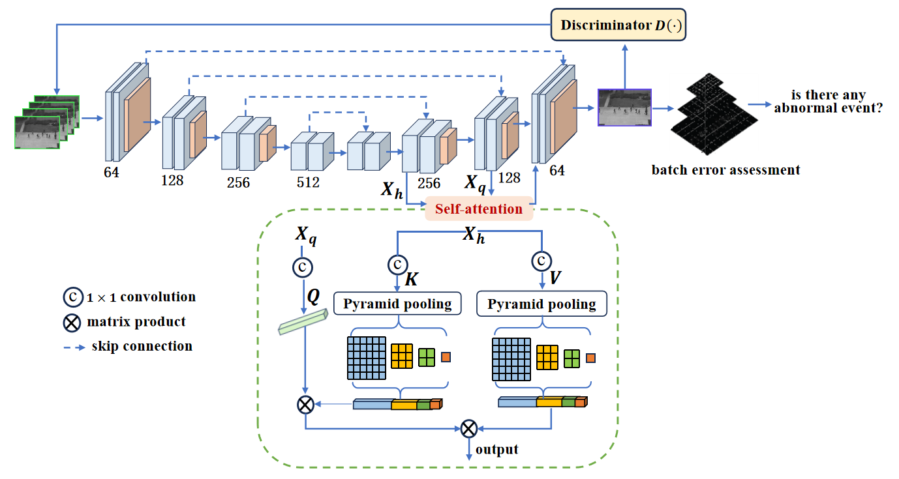
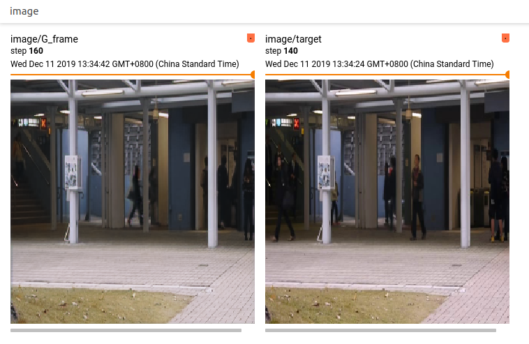
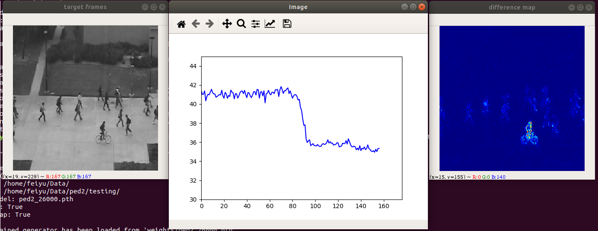

# Anomaly Event Detection
Pytorch implementation of anomaly event prediction for AECE:[A sparse pooling adversarial learning framework for anomaly event detection – A New framework].  
This implementation used lite-flownet instead of Flownet2SD and the generator network is slightly different.  
I trained on the ped2, avenue and ShanghaiTech datasets, the results:  

|     AUC                  |USCD Ped2    |CUHK Avenue         |ShanghaiTech |
|:------------------------:|:-----------:|:------------------:|:------------------:|
| STCEN  |96.9%        | 86.6%              |73.8%|
|  SPLF (ours)    |97.5%        | 88.7%              |75.1%|

### The network pipeline.  


## Environments  
PyTorch >= 1.1.  
Python >= 3.6.  
tensorboardX  
cupy  
sklearn  
Other common packages.  

## Prepare
- Download the ped2 and avenue datasets.  

|USCD Ped2                                                                            | CUHK Avenue                                                                           |
|:-----------------------------------------------------------------------------------:|:-------------------------------------------------------------------------------------:|
|[Google Drive](https://drive.google.com/open?id=1PO6BCMHUnmyb4NRSBFu28squcDv5VWTR)   | [Google Drive](https://drive.google.com/open?id=1b1q0kuc88rD6qDf5FksMwcJ43js4opbe)    |
|[Baidu Cloud: e0qj](https://pan.baidu.com/s/1HqDBczQn6nr_YUEoT7NnLA)                 | [Baidu Cloud: ufq6](https://pan.baidu.com/s/2z9GZQedG-8I_oxJ1RuwUaA)                  |

- Modify 'data_root' in `config.py`, and then unzip the datasets under your data root.
- Download the lite-flownet model and put it under the 'models/liteFlownet' folder, or the Flownet2SD model under the 'models/flownet2' folder.

|network-default.pytorch                                                             | FlowNet2-SD.pth  |
|:----------------------------------------------------------------------------------:|:--------------------------------------------------------------------------------------:|
| [Google Drive](https://drive.google.com/open?id=16w3P4A4s_m7WSwgq38VTqrGIS6lhj7Ys) |[Google Drive](https://drive.google.com/open?id=1gwBdKeaJjJomU68x3dNl9Vdy9i9EKiaI)      |
| [Baidu Cloud: auqh](https://pan.baidu.com/s/1OSXiPZ3kijkTBPgfgWAimA)               |[Baidu Cloud: v7qr](https://pan.baidu.com/s/1dfxVX_QX1JUUc6y3f6IDYw)                    |

- Download the trained model and put them under the 'weights' folder.  

|ped2_60.pth                                                                      | avenue_50.pth  |
|:----------------------------------------------------------------------------------:|:--------------------------------------------------------------------------------------:|
| [Google Drive](https://drive.google.com/open?id=1dgeoZoiO0V_Wql7k7w_tGFDyiaxroGeo) |[Google Drive](https://drive.google.com/open?id=2iwgRtkXU6-H8VwTKHqYLfkOZzHvfyGRw)      |
| [Baidu Cloud: 5hu9](https://pan.baidu.com/s/1y6pHwU0qSmbLmlSGni-93w)               |[Baidu Cloud: 92d8](https://pan.baidu.com/s/3ojLetmySGYW5ZSAIMPmdpw)                    |

## Train
```Shell
# Train by default with specified dataset.
python train.py --dataset=avenue
# Train with different batch_size, you might need to tune the learning rate by yourself.
python train.py --dataset=avenue --batch_size=16
# Set the max training iterations.
python train.py --dataset=avenue --iters=80000
# Set the save interval and the validation interval.
python train.py --dataset=avenue --save_interval=2000 --val_interval=2000
# Resume training with the latest trained model or a specified model.
python train.py --dataset=avenue --resume latest [or avenue_10000.pth]
# Train with Flownet2SD instead of lite-flownet.
python train.py --dataset=avenue --flownet=2sd
# Visualize the optic flow during training.
python train.py --dataset=avenue --show_flow
```
## Use tensorboard
```Shell
tensorboard --logdir=tensorboard_log/ped2_bs4
```


## Evalution
```Shell
# Validate with a trained model.
python evaluate.py --dataset=ped2 --trained_model=ped2_60.pth
# Show and save the psnr curve and the difference heatmap between the gt frame and the 
# generated frame during evaluating. This drops fps.
python evaluate.py --dataset=ped2 --trained_model=ped60.pth --show_curve --show_heatmap
```

